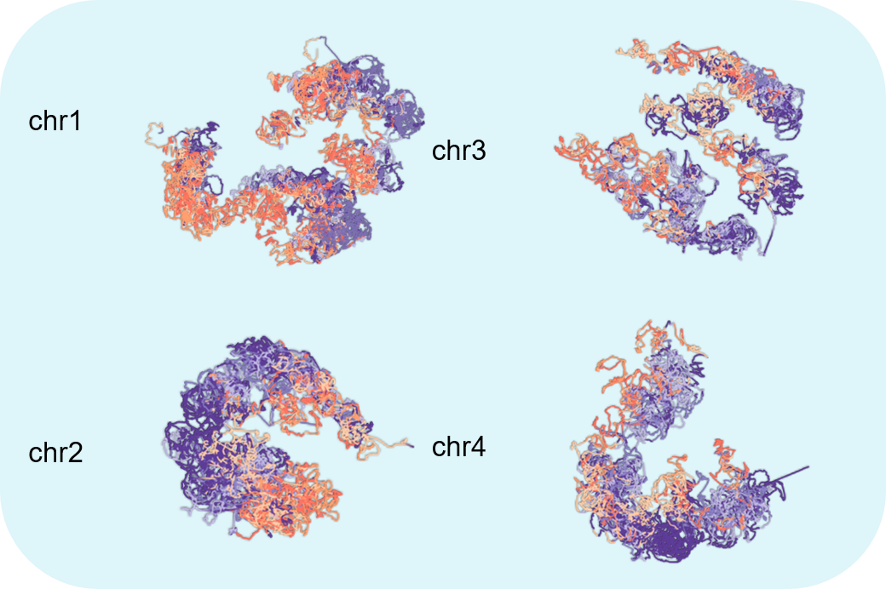
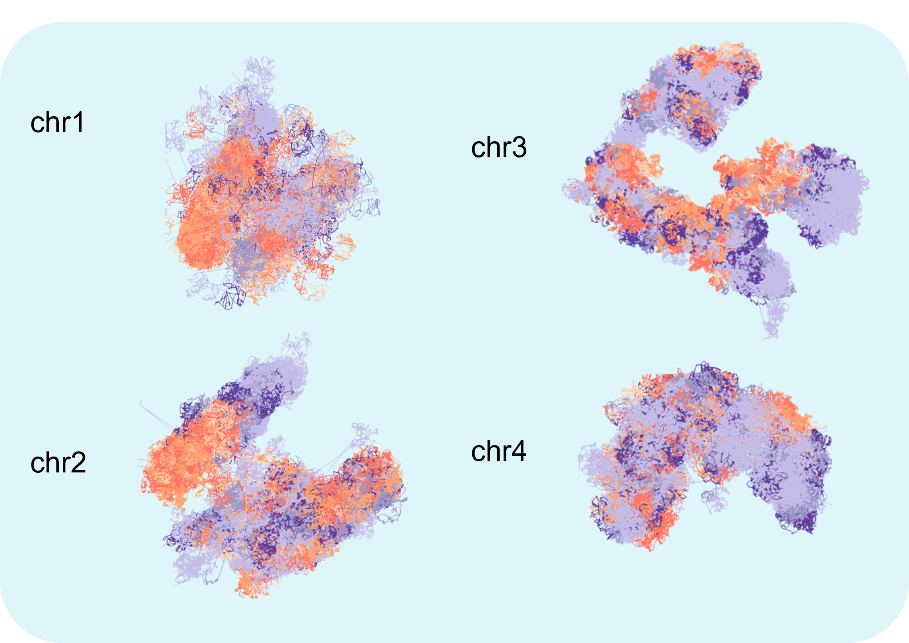

# FLAMINGO: **F**ast **L**ow-r**A**nk **M**atrix completion algorithm for reconstruct**IN**g high-resolution 3D **G**enome **O**rganizations

## Gallery
**The 3D structures for chromosome 1-4** in GM12878. The 3D structures for all 23 chromosomes could be found [here](https://docs.google.com/presentation/d/1dJXx5xVuXCd9MYfpq8AJwn1UPTieAgFbcdfJlnd8AbI/edit?usp=sharing). <br>



**An orbiting chromosome 1 on Youtube**<br>
[](https://youtu.be/75t2qSxke3E)

**The 3D genome structure in 1kb resolution for chromosomes 14,16,17,19,21 and 22**<br>


## Summary
We developed FLAMINGO to reconstruct the high-resolution 3D genome structures based on the chromatin contact maps with high scalability. By integrating the 1D epigenomics dataset, the integrative version of FLAMINGO (iFLAMINGO) is able to make cross-cell-type predictions and reconstruct high-resolution 3D structures from low-resolution contact maps.

## Introduction
FLAMINGO takes cell-type specific distance matrices generated by Hi-C as inputs. By applying the low-rank matrix completion method on the observed distance matrices, an accurate prediction of 3D coordinates of DNA fragments is made. By further integrating the 1D epigenomics dataset in the target cell-type and the Hi-C data in the source cell-type, the integrative version of FLAMINGO,iFLAMINGO, is able to make cross cell-type predictions in the target cell-type. iFLAMINGO is also able to reconstruct high-resolution 3D structures from low-resolution contact maps by integrating the high-resolution 1D epigenomics dataset and low-resolution Hi-C data.

## Dependencies
The implementation of the algorithm is based on bedtools and  R 3.5.1. It depends on three R packages: parallel, mgcv and Matrix.

## Installation of the FLAMINGOr package
The R package for FLAMINGO (*FLAMINGOr*) can be installed through Github using *devtools*:<br>
```
install.packages("devtools")
library(devtools)
install_github('wangjr03/FLAMINGO/FLAMINGOr')
```
### Input data 
Three standard formats of chromatin interaction data are supported: *.hic*, *.mcool* and the sparse matrix format.

### Reconstruct the 3D genome structure with FLAMINGOr
The main function of FLAMINGO can be utilized as follow:<br>
```
flamingo.main_func_large(
       hic_data_low,
       file_format,
       domain_res,
       frag_res,
       chr_size,
       chr_name,
       normalization,
       downsampling_rates,
       lambda,
       max_dist,
       nThread,
       alpha = -0.25,
       max_iter = 500,
       hic_data_high = NULL,
       norm_low = NULL,
       norm_high = NULL,
       n_row = 45000
     )
```
<br>

*Arguments*:<br>

*hic_data_low*: The input chromatin interaction data in .hic format, .mcool format or sparse
          matrix format.<br>

*file_format*: Foramt of the input chromatin interaction data. Could be .hic, .mcool or
          sparse matrix format.<br>

*domain_res*: Size of the domains in bps, e.g. 1e6.<br>

*frag_res*: Size of the fragment in bps, e.g. 5e3.<br>

*chr_size*: Size of the chromosome in bps.<br>

*chr_name*: Name of the chromosome, e.g. chr1.<br>

*normalization*: Normalization method.<br>

*downsampling_rates*: Fraction of contacts to be used for the
          reconstruction.<br>

  *lambda*: Lagrigian coefficient.<br>

*max_dist*: The maximum allowed distance between two consecutive points.<br>

 *nThread*: Number of threads available for the reconstruction.<br>

   *alpha*: Conversion factor between the interaction frequency and the pairwise
          distance. default -0.25.<br>

*max_iter*: The maximum number of iterations for the assembling algorithm. default 500.<br>

*hic_data_high*: Optional. The high resolution HiC data in sparse matrix
          format. Only required if the file_format is 'sparse matrix'.<br>

*norm_low*: Optional. The normalization vector for the low resolution
          Hi-C data. Only required if the file_format is 'sparse
          matrix'.<br>

*norm_high*: Optional. The normalization vector for the high resolution
          Hi-C data. Only required if the file_format is 'sparse
          matrix'.<br>

   *n_row*: Optional. The number of rows to use the large matrix format.
          Reduce the number if the memory is limited. default to 45000
          rows.<br>

*Example code:*<br>
Taking Hi-C data in GM12878 '4DNFI1UEG1HD.hic' as an example, the following commands reconstruct the 3D genome structure of chromosome 1 in 5kb resolution.<br>
```

library(FLAMINGOr)
library(GenomicFeatures)
all_size <- getChromInfoFromUCSC("hg38")
chr_name='1'
chr_name = as.numeric(chr_name)
chr_size = all_size[chr_name,2]
chr_name <- paste0('chr',chr_name)
res = flamingo.main_func_large(hic_data_low='../4DNFI1UEG1HD.hic',
                       file_format='hic',
                         domain_res=1e6,frag_res=5e3,
                         chr_size=chr_size,
                         chr_name=chr_name,
                         normalization='KR',
                         downsampling_rates=0.75,
                         lambda=10,max_dist=0.01,nThread=30,n_row=30000)

```

### output data format
A data frame with four columns containing the fragment id (the first column) and the 3D coordinates (the other three columns) will be returned.

### visualize the 3D genome structure using ParaView
ParaView is an open-source, multi-platform data analysis and visualization application. To visualize the 3D genome structure using FLAMINGO, the user need to convert the 3D coordinates into a *.vtk* file. In the FLAMINGOr package, a `write.vtk` function is provided for such conversion using the command below:<br>
```
write.vtk(points=res[,-1],lookup_table=rep(1,dim(res)[1]),name='chr1 5kb 3D structure',opt_path='./chr1_5kb.vtk')
```
*Arguments*:<br>

*points*: 3D coordiantes predicted by FLAMINGO in the x,y,z format. <br>

*lookup_table*: The annotation of each point, could be labels or scores, i.e. the compartment PC scores.<br>

*name*: output file name annotated within the file.<br>

*opt_path*: output file path including the file name. <br>

## Stand-alone Scripts of FLAMINGO 
The stand-alone scripts for all steps of FLAMINGO are provided below.
### Input data
The algorithm takes two kinds of datasets as inputs: (1) If the user simply wants to reconstruct the 3D genome structure from the observed Hi-C contact maps from experiments, only the pairwise interaction frequency matrices are required. (2) If the user wants to make cross cell-type predictions or predict high-resolution structures from the low-resolution contact maps (i.e. iFLAMINGO), the cell-type specific epigenomics data, e.g. DNase-seq data, are required. 
The pairwise interaction frequency matrices generated by Hi-C can be downloaded from GEO (GSE63525) and the cell-type specific DNase-seq data can be downloaded from the Roadmap epigenomic consortium. Descriptions of the data are listed below:
1. The interaction frequency matrix: The interaction frequency matrix under a given resolution is summarized in the sparse matrix format. The associated KR normalization factors should also be included in the same directory. Taking Hi-C for example, the interaction frequency data should has three columns:

| col | abbrev | type | description |
| -----| ----- | ----- | ----- |
| 1 | Frag.id.1 | integer | Index of the first DNA anchor |
| 2 | Frag.id.2 | integer | Index of the second DNA anchor |
| 3 | IF | float | Hi-C interaction frequency |

2. The cell-type specific DNase-seq data: The cell-type specific DNase-seq data should be stored in the bedGraph format with at least four columns. **This input is only required by iFLAMINGO and could be ignored for FLAMINGO.**

| col | abbrev | type | description |
| -----| ----- | ----- | ----- |
| 1 | chr | char | Name of the chromosome |
| 2 | start | integer | Start of the DNA fragment |
| 3 | end | integer | End of the DNA fragment |
| 4 | signal | float | DNase-seq signal strength |

### Description of scripts
The pipeline of the algorithm consists of eight pieces, including data preprocessing and modeling. A wrapper is provided to run the whole pipeline for each task and the user only needs to provide the path to the data. A detailed description of each piece is provided.

**Wrapper and sample scripts for large scale applications** <br> 
*process_data_wrapper.sh* : preprocess data, including step 1-6 introduced below.
*process_data_wrapper.sh: <path to 5kb-resolution Hi-C directory> <working directory> <path to the DNase-seq dataset> <path to 1mb-resolution Hi-C directory> <chromosome index>* . <br>
A sample * .sbatch * file to run the model on slurm-based HPC using job array is provided (* 7_resoncstruct_model_*_.sb *). <br>

**Scripts**<br>
1. *1_preprocess_HiC.R*: This script normalizes Hi-C interaction frequencies and converts it to pairwise distance. The normalization is based on the KR normalization provided by Rao et al (2014). The normalized interaction frequencies are then transformed to the pairwise distances using the exponential transformation with \alpha =-0.25. The normalized interaction frequency matrix and distance matrix are stored as .Rdata files for later use. <br>
  Command line usage: *Rscript 1_preprocess_HiC.R \<path to the folder containing the Hi-C data> \<output path (define the working directory)>* <br>
  **Notes**: The parameter path to the folder containing the Hi-C data’ refers to the directory containing raw interaction frequency results AND KR normalization parameter files.<br>
  
2. *2_generate_fragment_data.R*: This script divides the entire chromosome into large DNA domains,e.g. 1 mb. The interaction frequency matrices and distance matrices are generated for each domain by further dividing domains into small DNA fragments, i.e. 5kb. The intra-domain interaction frequency matrices and distance matrices are used for the reconstruction of intra-domain structures.<br>
Command line usage: *Rscript 2_generate_fragment_data.R \<path to the working directory> \<chromosome name, i.e. chr1>*
 
3. *3_generate_fragment_DNase.R*: This script generates the genomic location for all 5kb DNA fragments, which will be used for DNase integration and the downstream biological analysis. This part is only used by iFLAMINGO and could be skipped if no epigenomics data required.<br>
Command line usage: *Rscript 3_generate_fragment_DNase.R \<path to the working directory> \<chromosome name, i.e. chr1>*

4. *4_generate_DNase_profile.R*: This script generates the averaged DNase signal for each DNA fragment. This part is only used by iFLAMINGO and could be skipped if no epigenomics data required.<br>
Command line usage: *Rscript 4_generate_DNase_profile.R \<path to the working directory> \<path to the DNase bedgraph file>*
  
5. *5_impute_DNase_dist.R*: This script predicts the pairwise distance using the DNase signals of two DNA fragments and the 1D genomic distances based on a pre-trained regression model. This part is only used by iFLAMINGO and could be skipped if no epigenomics data required.<br>
Command line usage: *Rscript 5_impute_DNase_dist.R \<path to the working directory>*

6. *6_genereate_backbone_data.R*: This script processes low resolution Hi-C data, i.e. 1 mb-resolution, for the reconstruction of the domain-level structures. The method of normalization is the same as step 1.<br>
Command line usage: *Rscript 6_genereate_backbone_data.R \<path to the 5kb-resultion Hi-C data> \<the working directory> \<chromosome index>*

7. 7_reconstruct_within_cellline.R and 7_reconstruct_model_DNase.R: This step reconstructs the intra-domain structures from intra-domain distance matrices. It takes a pairwise distance matrix as input and returns the 3D coordinate matrix. This step has two options: (1) If the user simply wants to reconstruct the 3D genome structure from the observed Hi-C data,  then 7_reconstruct_within_cellline.R should be used (FLAMINGO). (2) If the user wants to make cross cell-type predictions or improve the resolution, then 7_reconstruct_model_DNase.R should be used (iFLAMINGO). <br>
Command line usage:
   1. *Rscript 7_reconstruct_within_cellline.R \fraction of basis> \<penalization term of distance between adjacent small DNA fragments> \<distance threshold to be penalized between adjacent small DNA fragments> \<input pairwise distance matrix of large DNA fragments> \<input pairwise distance matrix of large DNA fragments> \<output file name> \<output directory>*
   2. *Rscript 7_reconstruct_model_DNase.R \<fraction of basis> \<penalization term of distance between adjacent small DNA fragments> \<distance threshold to be penalized between adjacent small DNA fragments> \<input pairwise distance matrix of large DNA fragments> \<input pairwise distance matrix of large DNA fragments> \<output file name> \<output directory> \<DNase matrix generated in step 5>*<br>
**Notes**: The reconstruction procedure for each domain is independent and can be parallelized by running several jobs on different threads/CPUs at the same time. For some fragments, the script may be terminated due to invalid data. This is a normal case. The reason is that all entries for the input matrix are missing data, i.e. inf/NA for all pairwise distances, and no valid data to use. This problem is intrinsic to the Hi-C data and frequently observed for telomeres and centromeres. <br>

8. *8_ensemble_structure_V2.R*: This script assembles the intra-domain structures with the domain-level structures by rotating the intra-domain structures. 
Command line usage: *Rscript 8_ensemble_structure.R \<1mb interaction frequency matrix> \<constructed backbone structure> \<path to the output directory of step 7> \<5kb pairwise distance matrix> \<output file name>* <br>
**Notes**: The output file can be found in the output directory of step 7.

## Sample code

The sample code will reconstruct the 3D structure of chromosome 21 in GM12878 with samping rates 0.5. <br>

Clone the github repo and place the extracted sample data (https://drive.google.com/file/d/1zhH12OnhrCtMHtLdnSAC1NBryKajdWfL/view?usp=sharing) into the folder FLAMINGO <br>. The whole process could take around 20 mins.

`cd ./FLAMINGO/code`
`mkdir ../chr21`
`module load bedtools`

`Rscript 1_preprocess_HiC.R ../sample_data/GM12878_primary/5kb_resolution_intrachromosomal/chr21/MAPQGE30/ ../chr21/GM12878 chr21` <br>

`Rscript 2_generate_fragment_data.R ../chr21/GM12878 chr21` <br>

`Rscript 3_generate_fragment_DNase.R ../chr21/GM12878 chr21` <br>

`Rscript 4_generate_DNase_profile.R ../chr21/GM12878/Genomic_fragment ../../../sample_data/chr21_E116-DNase.imputed.pval.signal.bedgraph` <br>

`Rscript 5_impute_DNase_dist.R  ../chr21/GM12878/Genomic_fragment` <br>

`Rscript 6_generate_backbone_data.R ../sample_data/GM12878_primary/1mb_resolution_intrachromosomal/chr21/MAPQGE30/ ../chr21/GM12878 chr21` <br>

**Wrapper of step 1-6, skip this step if you already run them individually**:
`./process_data_wrapper.sh ../sample_data/GM12878_primary/5kb_resolution_intrachromosomal/chr21/MAPQGE30/ ../chr21/GM12878 .././../sample_data/chr21_E116-DNase.imputed.pval.signal.bedgraph ../sample_data/GM12878_primary/1mb_resolution_intrachromosomal/chr21/MAPQGE30/ chr21`  <br>

`mkdir ../chr21/GM12878/result_0.5` <br>

`for i in {1..50};do` <br>
`Rscript 7_reconstruct_within_cellline.R 0.5 10 0.3 ../chr21/GM12878/chr21_5kb_frag/Dist_frag${i}.txt ../chr21/GM12878/chr21_5kb_frag/IF_frag${i}.txt 5kb_frag${i} ../chr21/GM12878/result_0.5;`  <br>
`done`  <br>

`Rscript 7_reconstruct_within_cellline.R 0.5 10 0.3 ../chr21/GM12878/chr21_1mb_PD.txt ../chr21/GM12878/chr21_1mb_IF.txt backbone_structure ../chr21/GM12878` <br>

`Rscript 8_ensemble_structure_V2.R ../chr21/GM12878/chr21_1mb_IF.txt ../chr21/GM12878/backbone_structure.Rdata ../chr21/GM12878/result_0.5 ../chr21/GM12878/chr21_5kb_PD.Rdata 0.5_final_model` <br>

## Pre-calculated 3D genome structures
We provide the pre-calculated 3D genome structures for all 23 chromosomes in six cell-types under the directory *predictions* . The sub-directories are indexed by the name of cell-types. We also provide two results of iFLAMINGO, which are used in the original paper: (1) the 3D genome structure of chr21 in K562 based on the Hi-C data in GM12878 and DNase-seq data in K562 (chr21_GM_to_K562.txt); (2) The 3D genome structure of chromosome 10 in GM12878 cells under 5kb-resolution based on the Hi-C data in 25kb-resolution and DNase-seq data (chr10_25kb_to_5kb.txt), along with the 3D structure under 25kb-resolution (chr10_25kb.txt). The file format is summarized into the following table:

| col | abbrev | type | description |
| -----| ----- | ----- | ----- |
| 1 | chr | char | Name of the chromosome |
| 2 | start | integer | Start of the DNA fragment |
| 3 | end | integer | End of the DNA fragment |
| 4 | x | float | X-coordinates | 
| 5 | y | float | Y-coordinates | 
| 6 | z | float | Z-coordinates |

**Notes** In principle, FLAMINGO can also reconstruct 3D genome structures from contact maps generated by ChIA-PET, Capture-C and SPRITE.


